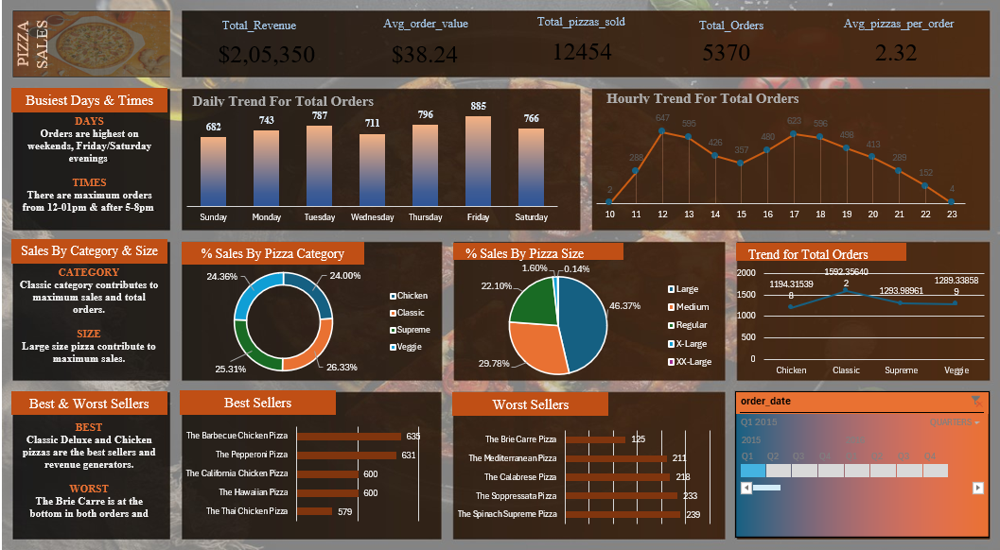

# 🍕 Pizza Sales Dashboard (Excel Project)

## 📌 Project Overview
This project presents an interactive Pizza Sales Dashboard built using Microsoft Excel.  
The dashboard provides insights into sales performance, revenue trends, customer ordering behavior, and product category performance.

The goal of this project is to analyze pizza sales data and generate meaningful business insights using Excel tools such as Pivot Tables, Charts, and Slicers.

---

## 📊 Key Insights

- Total Revenue Generated
- Total Orders & Quantity Sold
- Best-Selling Pizza
- Sales by Category (Veg/Non-Veg)
- Sales by Size (Small, Medium, Large)
- Monthly Sales Trends
- Peak Order Hours

---

## 🛠 Tools & Techniques Used

- Microsoft Excel
- Pivot Tables
- Pivot Charts
- Slicers
- Data Cleaning
- KPI Cards
- Dashboard Design Principles

---

## 📁 Dataset

The dataset contains:
- Order ID
- Order Date
- Pizza Name
- Category
- Size
- Quantity
- Price
- Total Price

---

## 📷 Dashboard Preview

---

## 📈 Business Problem Solved

This dashboard helps business stakeholders:
- Identify top-performing products
- Understand customer preferences
- Monitor monthly revenue trends
- Optimize pricing and inventory decisions

---

## 👨‍💻 Author

Divyansh Gupta  
Aspiring Data Analyst | Excel | SQL | Python | Power BI  
